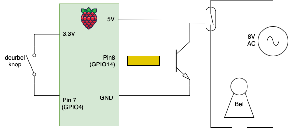

# Deurbel

Deurbel is een applicatie met deurbel functionaliteit:

Een fysieke knop bij de deur wordt ingedrukt. 
Dit wordt gedetecteerd door de applicatie en een aantal acties worden uitgezet:
1. De gong wordt geluid
2. (optioneel) Een foto wordt genomen
3. (optioneel) Een bericht wordt gestuurd via Telegram, met daarin indien de foto.
4. (optioneel) Een trigger wordt gestuurd naar home assistant.

## Elektrotechnisch schema

Aan de linkerkant is de input, dit is een eenvoudige deurbel schakelaar, die is verbonden met de 3.3 V spanningsbron van de Raspberry.
Als er op de schakelaar wordt gedrukt komt er spanning op Pin7 te staan. 
Hierbij wordt gebruik gemaakt van de interne pull down weerstand van de Pi, omdat er anders kortsluiting zou ontstaan. 
Mocht je dat niet vertrouwen kun je altijd nog een extra weerstand er tussen zetten, maar het is hier niet nodig.

Aan de rechterkant is de output zijde. Hierbij is gebruik gemaakt van een transistor om de relais te kunnen laten schakelen.
 
Doordat de deurbel gong gevoed moet worden door een wisselspanning van 8 V, is gebruik gemaakt van de deurbel trafo die in de meterkast zit.
Dit kan echter niet zomaar geschakeld worden vanuit de Raspberry, dus vandaar dat hiervoor een relais (systeem) is gebruikt.
De relais zal schakelen als er stroom door de magneet (van de relais) kan lopen, wat gebeurt als de transistor in geleiding komt als gevolg van de spanning op de basis.
Dit wordt geleverd door Pin 8 'Aan' te zetten vanuit het programma.

## Installatie

Uitgaande van een schone raspberry Pi bullseye release moeten de volgende pakketten worden geïnstalleerd:

    sudo apt-get install git python3-distutils python3-dev libffi-dev cargo python3-pip libssl-dev libbz2-dev libreadline-dev liblzma-dev libsqlite3-dev rpi.gpio

Installeren van pyenv voor de virtuele environment:

    curl https://pyenv.run | bash

Voeg toe aan .bashrc:

    echo 'export PYENV_ROOT="$HOME/.pyenv"' >> ~/.bashrc
    echo 'command -v pyenv >/dev/null || export PATH="$PYENV_ROOT/bin:$PATH"' >> ~/.bashrc
    echo 'eval "$(pyenv init -)"' >> ~/.bashrc

En aan .profile:

    echo 'export PYENV_ROOT="$HOME/.pyenv"' >> ~/.profile
    echo 'command -v pyenv >/dev/null || export PATH="$PYENV_ROOT/bin:$PATH"' >> ~/.profile
    echo 'eval "$(pyenv init -)"' >> ~/.profile

Installeren van python 3.11 in de virtuele omgeving:

    pyenv install 3.11

Installeren van Poetry voor package management:
    
    curl -sSL https://install.python-poetry.org | python3 -

Code uitchecken:
git clone https://github.com/bobverschoor/deurbel.git

Het RPI.GPIO-package moet op deze omgeving worden toegevoegd aan poetry via:

    poetry add RPi.GPIO

Test of het script kan draaien zonder fouten via:

    poetry run python src/deurbel.py

Als dat zo is, kun je dit onder systemd als user service starten door het service-script te kopiëren 
naar de juiste directory, en vervolgens de service te starten:

    mkdir -p ~/.config/systemd/user/
    cp resources/deurbel.service ~/.config/systemd/user/
    systemctl --user enable deurbel
    systemctl --user daemon-reload
    systemctl --user start deurbel

